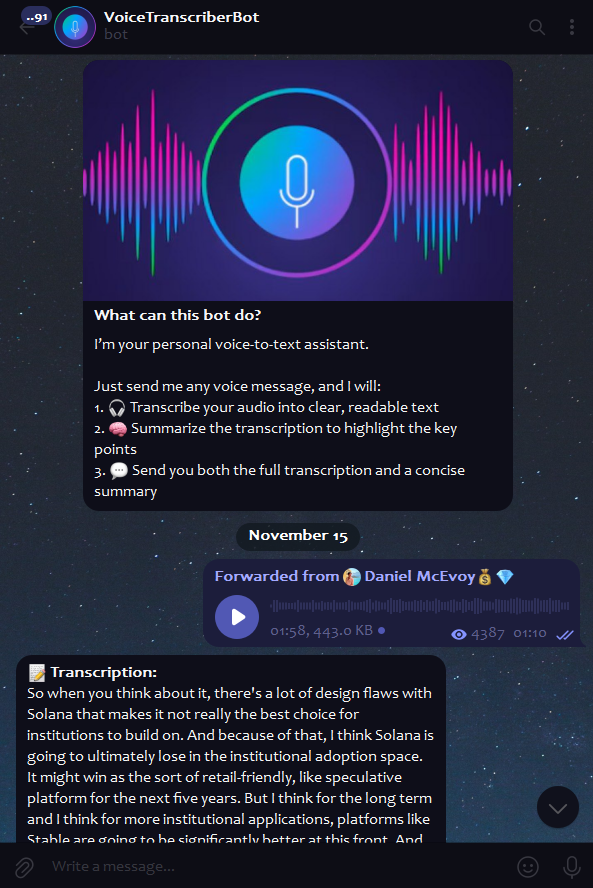
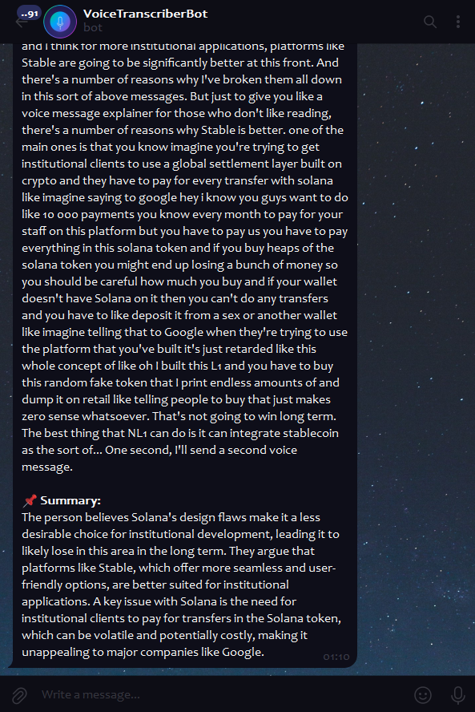
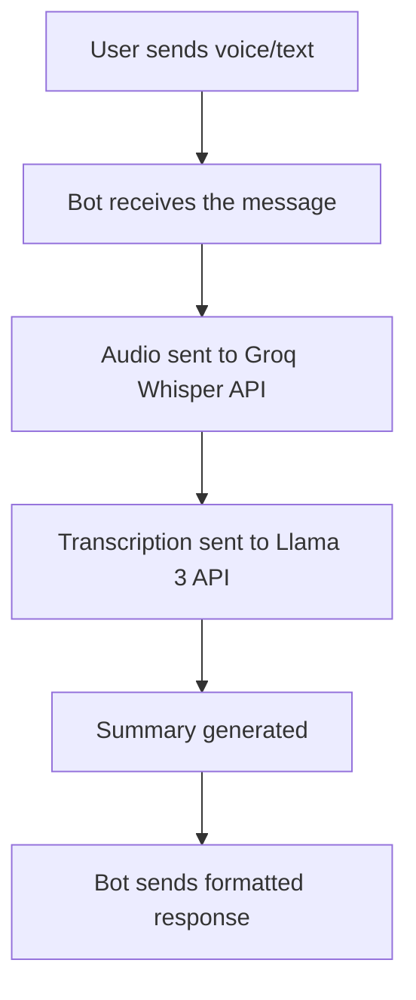

# 🎙️ Telegram Voice Transcriber Bot

A simple Telegram bot built with Python that automatically transcribes voice messages
and audio files into text, then generates concise summaries using Groq APIs.

The project is designed to be easily hosted on a serverless setup, making it lightweight and
cost-efficient.
Python dependencies are managed using _UV_ package manager, providing reproducible environments
and clean dependency control.

## Features ✨

- 🎤 Transcribe voice notes from forwarded messages and direct recordings
- 📝 Summarize plain text messages (even without audio)
- 🔊 Accurate transcription using the Whisper model
- 🧠 Intelligent summaries powered by Llama 3
- 🎧 Multiple audio format support
- 🔐 User authorization system for secure access
- 🛠️ Error handling and logging for reliability
- ☁️ Serverless-ready lightweight design
- 📦 Clean dependency management using UV

## What the Bot Can Do

| Input                      | Output                  |
|----------------------------|-------------------------|
| 🎤 Voice message           | Transcription + Summary |
| 🔄 Forwarded voice message | Transcription + Summary |
| 📝 Text message            | Summary only            |

## Demo 📸

<div style="display: flex; gap: 20px">
  
  
</div>

## Prerequisites 📋

- Python 3.10 or higher
- [uv](https://docs.astral.sh/uv/) package manager
- Telegram Bot Token (from [@BotFather](https://t.me/BotFather))
- Groq API Key (Get it [here](https://console.groq.com/keys))

## Installation 🚀

1. Clone the repository:

```bash
git clone https://github.com/AndriiSonsiadlo/VoiceTranscriber-telegram-bot.git

cd VoiceTranscriber-telegram-bot
```

2. Install dependencies:

```bash
uv sync
``` 

3. Create a `.env` file in the root directory:

```bash
cp .env.example .env
```

4. Edit the `.env` file and add your Telegram Bot Token and Groq API Key.:

```bash
TELEGRAM_BOT_TOKEN=your-telegram-bot-token
GROQ_API_KEY=your-groq-api-key
```

5. Configure authorized users:

- Open `main.py` and locate the `AUTHORIZED_USER_IDS` list
- Add your Telegram user ID to the list (you can get your ID by messaging @userinfobot on Telegram)

```python
AUTHORIZED_USER_IDS = [your_telegram_id]
```

## Usage 🎯

1. Start the bot:

```python
uv run python main.py
```

2. In Telegram:

- Forward or send directly any message containing a voice note to the bot
- Wait for the bot to process and return both transcription and summary

## How It Works 🔄



## License 📄

This project is licensed under the MIT License - see the [LICENSE](LICENSE) file for details.
